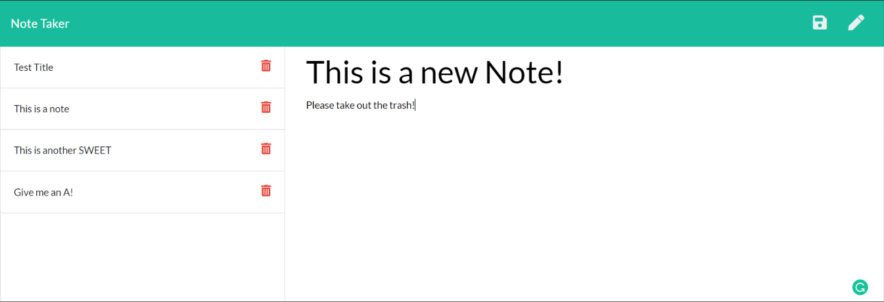

# The Note Taker App!

## Description
This app allows users to keep track of simple notes!
## Table of Contents
- [Usage](#usage)
- [Credits](#credits)
- [License](#license)

## Badges

    
## Usage
    
Simply enter a note and click the save icon in the upper right hand corner of the screen!
    
## Credits
    
Created by [d606n6k](https://github.com/d606n6k)
    
## License
License: MIT

## Features
- easily take notes and retrieve them for later!

## How to Contribute
If you would like to contribute to this project, please fork the project as needed.

## Questions
Have any questions for the author? Contact this author via [Email](mailto:aaronlucht@gmail.com)

Check out the author's [Github](https://github.com/d606n6k)
